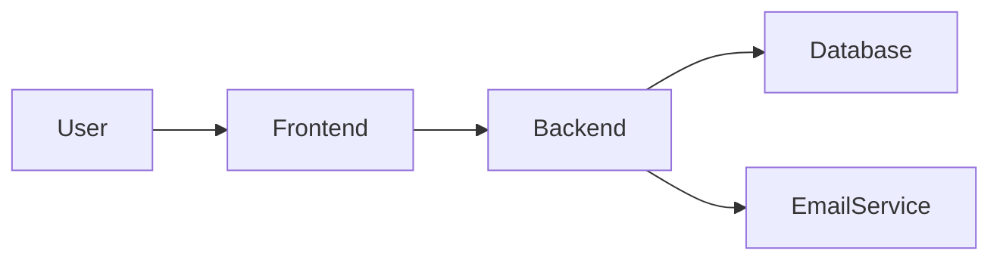

# ARCHITECTURE

## System diagram

## Data flow

1. User enters tool spend in the frontend.
2. Frontend computes a local audit with the audit engine.
3. Backend routes accept audit or lead capture requests.

## Stack choice

React + Vite for fast frontend development.
Express for a lightweight backend API.

## Scaling notes

If this handled 10k audits/day, add caching, queueing, and persistent storage.
